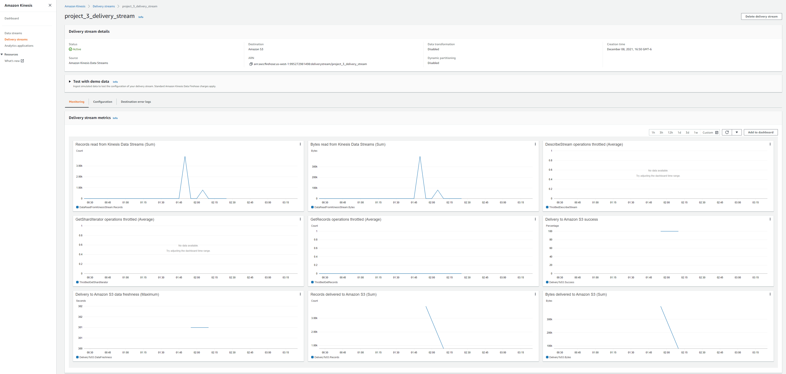

# Streaming-Finance-Data-with-AWS-Lambda

## Introduction

This is a Big Data Technology project where I will be analyzing Streaming Finance Data with AWS Lambda. In order to do that, different sorts of big data technologies will be used in this project which will be described in brief below.

## Infrastructure (Big Data Technologies)

This project consists of three major infrastructure elements that work in tandem:

* AWS Lambda: A lambda function that gathers the data (**DataTransformer**)
* AWS Kinesis: A Kinesis stream that holds the data (**DataCollector**) (Both Data and Firehose Stream)
* AWS Athena: A serverless process that allowed me to query the S3 data (**DataAnalyzer**) (Based on AWS Glue by creating Crawler)

## Brief Procedures

AWS Lambda Functions (with Layer) -> AWS Kinesis (Data Stream) -> AWS Glue -> AWS Athena -> Jupyter Notebook Analysis

Step 1: At first an *AWS Lambda* function was created to load the streaming data. However, in order to run the function, I needed to use a Layer which was built and provided by  Professor Karim. (**DataTransformer**)

Step 2: The streaming data was then pushed to an *AWS S3* bucket. However, in order do that, I used *AWS Kinesis* data stream since these were streaming data, not static ones.  (**DataCollector**) 

Step 3: Finally, with the *AWS Glue*, by building a *Crawler*, I ran some query in *AWS Athena* to generate data which was further analyzed in a local Jupyter notebook. (**DataAnalyzer**)

## Data Analysis

The Analysis part was very minimal part of this project:

* The first plot was a barplot just to observe the pattern of prices for every types of stocks.

* The later two were focused on time series where a drastic price change trend was observed for **Facebook** and **Netflix** stocks.

##  Configuration Details:

### Kinesis Configuration

The folowing screenshot was from AWS Kinesis to show the streaming system.

## Acknowledgement

 - The Layer for running the AWS Lambda function was created and provided by my Professor Mottaqui Karim. 
